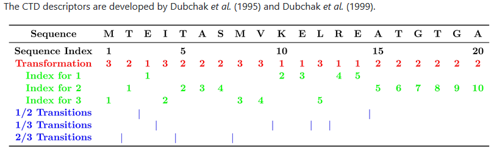
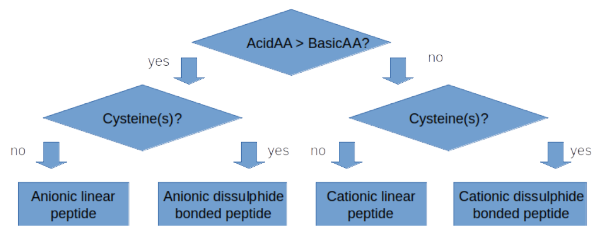

# Macrel

Macrel is a computational pipeline which can

1. classify peptides into antimicrobial/non-antimicrobial,
2. classify peptides into hemolytic/non-hemolytic,
3. predict peptides from genomes (provided as contigs) or metagenomes (provided
   as short-reads) and output all the predicted anti-microbial peptides found.

See the [usage section](usage) for more information.

If you use this software in a publication please cite

>   FACS: antimicrobial peptide screening in genomes and metagenomes
>   Celio Dias Santos-Junior, Shaojun Pan, Xing-Ming Zhao, Luis Pedro Coelho
>   bioRxiv 2019.12.17.880385; doi:
>   [https://doi.org/10.1101/2019.12.17.880385](https://doi.org/10.1101/2019.12.17.880385)

(The preprint still uses the old name of the tool, _FACS_, and will be updated
soon).

**NOTE**: This is still a _work in progress_ and, while the results of the tool
should be correct, we are still working on making Macrel easier to install and
use.

**IMPORTANT**: Macrel is also available as a [webserver](http://big-data-biology.org/software/macrel),
please pay a visit to us.

Macrel represents a joint effort of Celio Dias Santos Jr., Shaojun Pan,
[Xing-Ming Zhao](http://comp-sysbio.org/members/intro_zxm.html), and [Luis Pedro
Coelho](http://luispedro.org) from the _Institute of Science and Technology for
Brain-Inspired Intelligence (ISTBI)_ at Fudan University (Shanghai, China).

## Background

Antimicrobial peptides (AMPs) are peptides with a huge variety of biological activities (such as anticancer, antibacterial, antifungal and insecticidal), and their sequences are key to that activity. Microbes producing AMPs can limit the growth of other microorganisms and should be considered another normal source of them. Microbial AMPs are quite distinct from eukaryotic ones, since they can be obtained from nonribosomal synthesis. Thus, nonribosomal peptides can adopt different structures, such as cyclic or branched structures, and carry modifications like N-methyl and N-formyl groups, glycosylations, acylations, halogenation, or hydroxylation. Some examples of commercial microbial AMPs include polymyxin B and vancomycin, both FDA-approved antibiotics (Zhang and Gallo, [2016](https://www.sciencedirect.com/science/article/pii/S0960982215014098)).

Most AMPs are peptides 10-50 residues long (some reaching 100 amino acids), with charges ranging between 2 and 11, consituted of approximately 50% of hydrophobic residues (Zhang and Gallo, [2016](https://www.sciencedirect.com/science/article/pii/S0960982215014098)). The formation of amphiphilic ordered structures works as a driving force for membrane binding and disruption, a key AMP feature. The helix destabilization often can reduce the cytotoxicity of AMPs, although this can result in reduction of the antimicrobial effects (Malmsten, [2014](https://www.tandfonline.com/doi/full/10.3109/03009734.2014.899278); Borgden, [2005](https://www.ncbi.nlm.nih.gov/pubmed/15703760?dopt=Abstract); Pasupuleti et al., [2012](www.ncbi.nlm.nih.gov/pubmed/22074402?dopt=Abstract); Hancok and Sahl, [2006](https://www.ncbi.nlm.nih.gov/pubmed/17160061?dopt=Abstract); Shai, [2002](https://www.ncbi.nlm.nih.gov/pubmed/12491537?dopt=Abstract); Stromstedt et al., [2006](https://www.ncbi.nlm.nih.gov/pubmed/19029324?dopt=Abstract)). There is a dynamic interchange in AMPs structure and topologies along the interaction with the microbial cell membranes (Samson, [1998](https://www.sciencedirect.com/science/article/pii/S1359029498800277)). Electrostatic interactions of AMPs with the outer membrane surface of prokaryotic cells (negatively charged) is the primary mechanism for antimicrobial activity. Most AMP activities are associated to the rupture of cell membrane, promoting the leakage of cell contents. Other cases are based in the AMP translocation across the cell membrane and the inhibition of essential cellular processes (e.g. protein synthesis, nucleic acid synthesis, enzymatic activities) (Brogden, [2005](https://www.ncbi.nlm.nih.gov/pubmed/15703760)). Based on the mechanisms of action, AMPs are categorized into membrane acting and nonmembrane acting peptides.

The genomic era was constrasted by the reality of hundreds of available bacterial genomes that have so far failed to deliver the hoped-for new molecular targets for antibiotics. However, so far it always have focused in the active molecules produced by the metabolism, instead searching for active peptides or proteins. The best reason to bet in host defense antimicrobial peptides or AMPs is that they remained potent for millions of years, constituting a useful strategy to develop a new generation of antimicrobials meeting the worldwide growing antibiotic resistance problem. However, the prediction of small genes from meta-genomic/transcriptomic sequences and the prediction of active AMPs are the main problems with AMPs mining from meta- and genomic data sets.

Current methods to small genes prediction tipically lead to high rates of false positives (Hyatt et al., [2010](https://www.ncbi.nlm.nih.gov/pubmed/20211023)). Recent smORFs surveys demonstrated that these methods followed by a filtering of false-positives can lead to biologically active smORFs (Miravet-Verde et al., [2019](https://www.ncbi.nlm.nih.gov/pubmed/30796087); Sberro et al., [2019](https://www.ncbi.nlm.nih.gov/pubmed/31402174)). Furthermore, the prediction of AMP activity demands techniques other than homology-based methods, due to the degeneration of searches at smaller sequences. Several machine learning-based methods demonstrated high accuracy in predicting antimicrobial activity in peptides (Xiao et al., [2013](https://www.ncbi.nlm.nih.gov/pubmed/23395824); Meher et al., [2017](https://www.ncbi.nlm.nih.gov/pubmed/28205576); Bhadra et al., [2018](https://www.ncbi.nlm.nih.gov/pubmed/29374199)), although, none of them represented a full pipeline to extract AMPs from genomic data and filter off mispredictions. Our main goal with Macrel is a highthroughput screening system of AMPs, through machine learning, able to retrieve AMP sequences with high confidence from meta(genomic) reads.

Macrel can be used in a wide-ranging of scenarios, such as screening for novel AMPs, generating candidates to further testing and patenting, as well as, determination of _microbiome quorum sensing_ mechanisms linking AMPs to health conditions or presence of diseases.

## Pipeline overview

Macrel pipeline does:

1. quality trimming of single- and paired-end reads,

2. assembly of reads into contigs

3. small genes prediction,

4. clustering of peptides at 100% of similarity and 100% coverage,

5. calculation of the features of the predicted peptides,

6. classification of peptides into AMPs by using Random Forests,

7. classification of AMPs accordingly to their hemolytic activity also using Random Forests,

8. calculate AMPs abundance in meta(genomic) samples by reads mapping.

Macrel is fast and works by coordinating [NGLess](https://github.com/ngless-toolkit/ngless), [megahit](https://github.com/voutcn/megahit), [prodigal](https://github.com/hyattpd/Prodigal) and [PALADIN](https://github.com/ToniWestbrook/paladin). It is implemented in Python and R. Its models were trained with [Scikit-Learn](https://github.com/scikit-learn/scikit-learn) python module, and the descriptors are calculated with the [Peptides](https://cran.r-project.org/web/packages/Peptides/index.html) R package.

## AMPs classification

The 22 descriptors adopted by Macrel are hybrid comprising local and global contexts to do the sequence encoding. Macrel performs firstly a distribution analysis (Figure 1) of three classes of residues in two different features (Solvent accessibility and *Free energy to transfer from water to lipophilic phase*) as shown in Table 1. The novelty in this method is using the *Free energy to transfer from water to lipophilic phase* (FT) firstly described by Von Heijne and Blomberg, [1979](https://febs.onlinelibrary.wiley.com/doi/pdf/10.1111/j.1432-1033.1979.tb13100.x) to capture the spontaneity of the conformational change that AMPs suffer while their transference from water to the membrane. For more info about the other descriptors used in Macrel and the algorithms used to train the classifiers, please refer to the Macrel [preprint](https://www.biorxiv.org/content/10.1101/2019.12.17.880385v1.full).

**Figure 1.** Method of sequence encoding using CTD (Composition, Distribution and Transition). (Source: Dubchak et al., [1995](https://www.ncbi.nlm.nih.gov/pmc/articles/PMC41034/))

**Table 1.** Classes adopted to the sequence encoding of the distribution at the first residue of each class. The Solvent Accessibility was adopted as in previous studies (Dubchak et al. [1995](https://www.ncbi.nlm.nih.gov/pmc/articles/PMC41034/), [1999](https://www.ncbi.nlm.nih.gov/pubmed/10382667)), however, the new feature FT was adapted from Von Heijne and Blomberg, [1979](https://febs.onlinelibrary.wiley.com/doi/pdf/10.1111/j.1432-1033.1979.tb13100.x).

| Properties     | Class I     | Class II     | Class III     |
|:--------------------------------------------------------:    |:------------------------:    |:------------------    |------------------:    |
| Solvent accessibility     | A, L, F, C, G, I, V, W     | R, K, Q, E, N, D     | M, S, P, T, H, Y     |
| FT     | I,L,V,W,A,M,G,T     | F,Y,S,Q,C,N     | P,H,K,E,D,R     |

In this sense, despite the high accuracy and sensitivity, other works still suggest that methods independent of sequence order and mostly based in cheminformatics have comparable statistics (Boone et al., [2018](https://bmcbioinformatics.biomedcentral.com/track/pdf/10.1186/s12859-018-2514-6)). Fjell et al. ([2009](https://pubs.acs.org/doi/10.1021/jm8015365)) has shown using a combination of 77 QSAR (quantitative structure-activity relationships) descriptors that artificial neural network models could predict the extension of peptides activity, not only classify them. Thus, these methods could be joined to achieve a better performance and fix their pitfalls, since the sequence order independent methods fail in classify, however are good to describe activity; and sequence encoding is essential to a good classification, but fails when predict activity extension.

The other descriptors (independent of sequence order) used in Macrel classifiers are widely used in the AMPs description, as follows:

     - tinyAA (A + C + G + S + T)
     - smallAA (A + B + C + D + G + N + P + S + T + V)
     - aliphaticAA (A + I + L + V)
     - aromaticAA (F + H + W + Y)
     - nonpolarAA (A + C + F + G + I + L + M + P + V + W + Y)
     - polarAA (D + E + H + K + N + Q + R + S + T + Z)
     - chargedAA (B + D + E + H + K + R + Z)
     - basicAA (H + K + R)
     - acidicAA (B + D + E + Z)
     - charge (pH = 7, pKscale = "EMBOSS")
     - pI (pKscale = "EMBOSS")
     - aindex (relative volume occupied by aliphatic side chains - A, V, I, and L)
     - instaindex -> stability of a protein based on its amino acid composition
     - boman -> overall estimate of the potential of a peptide to bind to membranes or other proteins as receptor
     - hydrophobicity (scale = "KyteDoolittle") -> GRAVY index
     - hmoment (angle = 100, window = 11) -> quantitative measure of the amphiphilicity perpendicular to theaxis of any periodic peptide structure, such as the alpha-helix or beta-sheet

We opted to use random forests after some tests with alternative algorithms. The training of AMPs classifier used the same parameters and data sets used by Bhadra et al. ([2018](https://www.nature.com/articles/s41598-018-19752-w#Sec9)), while the classifier of hemolytic peptides was trained and tested with the data sets previously established by Chaudhary et al. ([2016](https://www.nature.com/articles/srep22843)).

The models here mentioned were implemented to filter off the non-AMP peptides and classify AMPs into hemolytic or not. After that, this script also submits the predicted AMPs to a decisions tree (Figure 2), classifying AMPs into 4 families accordingly to their nature (Cationic or Anionic) and structure (linear or disulfide bond forming). These classifications are then available in an output table with sequence, random identifiers, hemolytic nature and associated probabilities are also given. 

**Figure 2.** Decision tree to classification of peptides into different classes accordingly to their composition and capacity in forming disulfide bonds (Legend: AcidicAA - Acidic amino acids: B + D + E + Z; BasicAA - Alkaline amino acids: H + K + R).

## Benchmark

Benchmark procedures showed that Macrel models are efficient in retrieving AMPs with statistics that are similar to the top state-of-art methods (Table 2). The AMP prediction model was compared at two levels the first level with it trained with the small training dataset (1:3 positives:negatives) and when trained with the unbalanced dataset from AMPep (1:50 AMPs to non-AMPs). The final results (Table 2) shows clearly that Macrel models are comparable in retrieving AMPs from the testing dataset reaching accuracies very close to the best systems. However, Macrel AMP classifier trained with the unbalanced dataset outperforms other methods in terms of precision, what is benefitial in the work with meta(genomic) samples, which usually present few AMPs per sample.

**Table 2.** Comparison of Macrel and other state-of-art AMP prediction systems. All systems were tested with the benchmark data set from Xiao et al. [2013](https://www.ncbi.nlm.nih.gov/pubmed/23395824).

| **Method** | **Acc.**    | **Sp.**     | **Sn.**     | **Pr.**     | **MCC**  | **Refererence** |
| :---: | :---: | :---: | :---: | :---: | :---: | :---: |
| AmPEP | **0.981**   | -   | -    | -   | **0.92** | doi:10.1038/s41598-018-19752-w   |
| MACREL 1:3 | 0.953   | 0.972   | 0.935   | 0.971   | 0.91 | This study |
| iAMP-2L | 0.947   | 0.92    | 0.974   | 0.924   | 0.90 | doi: 10.1038/srep42362  |
| MACREL 1:50 | 0.946   | **0.998**   | 0.895   | **0.998**   | 0.90 | This study |
| AMAP  | 0.922   | 0.861   | 0.984   | 0.876   | 0.85 | doi: 10.1016/j.compbiomed.2019.02.018  |
| CAMPR3-NN | 0.799   | 0.709   | 0.89    | 0.753   | 0.61 | doi:  10.1093/nar/gkv1051  |
| APSv2 | 0.779   | 0.572   | **0.987**   | 0.697   | 0.61 | doi: 10.1093/bioinformatics/bty179  |
| CAMPR3-DA | 0.716   | 0.495   | 0.938   | 0.65    | 0.48 | doi:  10.1093/nar/gkv1051  |
| CAMPR3-SVM | 0.676   | 0.398   | 0.954   | 0.613   | 0.42 | doi:  10.1093/nar/gkv1051  |
| CAMPR3-RF | 0.65    | 0.335   | 0.965   | 0.592   | 0.39 | doi:  10.1093/nar/gkv1051  |
| iAMPpred | 0.643   | 0.325   | 0.962   | 0.588   | 0.37 | doi: 10.1038/srep42362  |

Meanwhile, the hemolytic prediction model implemented in Macrel has a comparable performance of the state-of-art methods previously tested by Chaudhary et al., [2016](https://www.nature.com/articles/srep22843) as shown in Table 3. The MCC measure also shows our model performing similarly to the models implemented by Chaudhary et al. [2016](https://www.nature.com/articles/srep22843).

**Table 3.** Comparison of the performance of different hemolytic activity prediction systems. All the systems were trained and benchmarked with HemoPI-1 data sets used by Chaudhary et al., [2016](https://www.nature.com/articles/srep22843).

| **Methods** | **Algorithm** | **Sn.** | **Sp.** | **Acc.** | **MCC** |
| :---: | :---: | :---: | :---: | :---: | :---: |
| HemoPI-1 | SVM | 0.957 | **0.948** | **0.953** | **0.91** |
| HemoPI-1 | H | **0.96** | 0.946 | **0.953** | **0.91** |
| HemoPI-1 | IBK | 0.955 | 0.937 | 0.946 | 0.89 |
| HemoPI-1 | RF | 0.941 | 0.946 | 0.943 | 0.89 |
| MACREL | RF | 0.918 | 0.964 | 0.941 | 0.88 |
| HemoPI-1 | Log | 0.934 | 0.937 | 0.936 | 0.87 |
| HemoPI-1 | MP | 0.939 | 0.928 | 0.933 | 0.87 |
| HemoPI-1 | JK48 | 0.896 | 0.885 | 0.89 | 0.78 |

Our classifiers seems to be extremely interesting in the execution of the filtering off non-AMP peptides and classifying them into hemolytic or non-hemolytic peptides. The models implemented in Macrel used the same set of descriptors and, although are not the most accurate, ensure highly precise results, important to meta(genomic) samples work.
